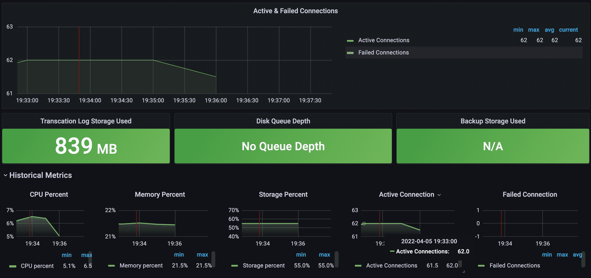
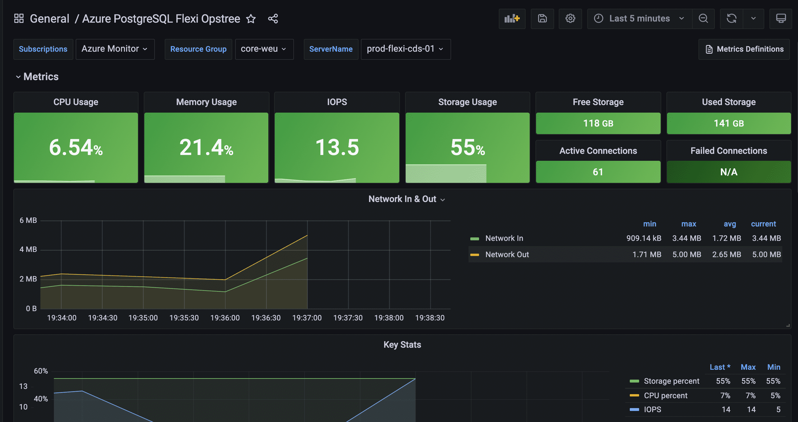

## Azure Postgresql Flexi

This dashboard will fetch all the Azure Monitor metrics on Grafana, For fetching the metrics on Grafana we need to install Azure Monitor Plugin on Grafana and then integrate the same with Azure Monitor by creating a service principal account on the Azure side.

### Metrics we are monitoring 
- CPU Usage
- Memory Usage
- IOPS
- Storage Usage
- Free Storage
- Active Connections
- Used Storage
- Failed Connections
- Network In & Out
- Read Throughput / Sec
- Write Throughput / Sec
- Write IOPS
- Read IOPS
- Transaction Log Storage Used
- Disk Queue Depth
- Backup Storage Used

### Integration
Please [click here](https://docs.microsoft.com/en-us/azure/azure-monitor/visualize/grafana-plugin#:~:text=Go%20to%20the%20Grafana%20Home,data%20source%20you've%20configured.) to follow the official documentation for the Azure  integration

### 

### Contributor Information
**vineet.yadav@opstree.com**