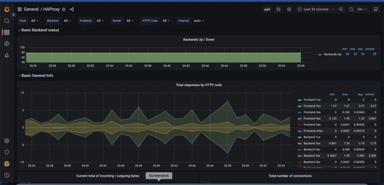
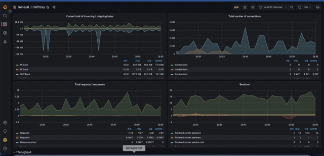
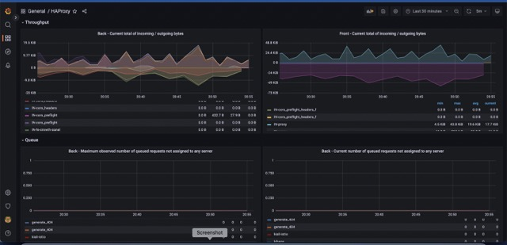
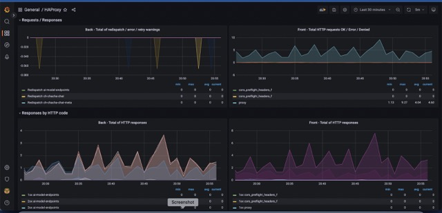
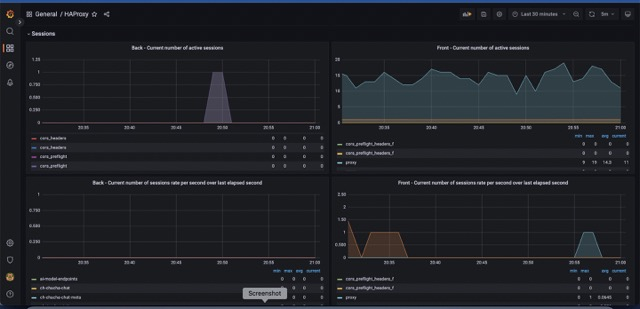
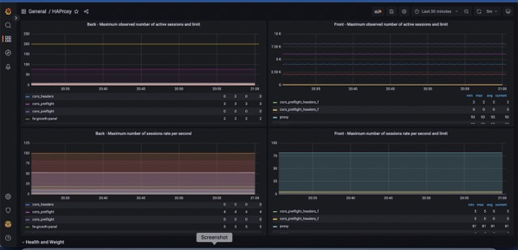
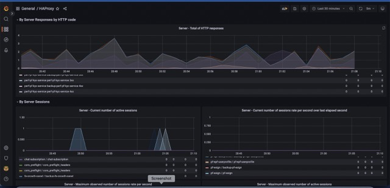
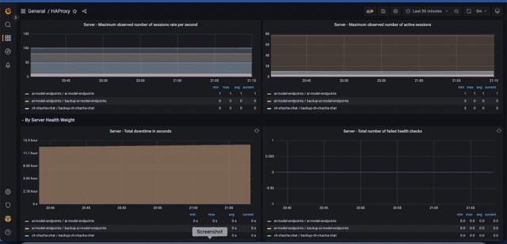
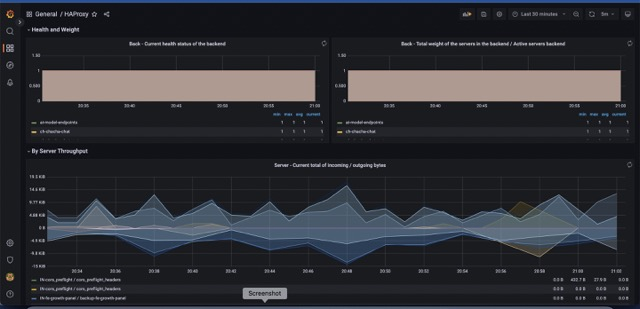
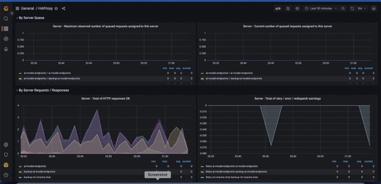

## HAProxy Dashboard

### Metrics List
**Frontend Monitoring Metrics**
- Request Rate [req_rate]
- Session Rate
- Error Requests
- Denied Requests
- HTTPS Response Codes 4xx and 5xx
- Network I/O

**Backend Monitoring Metrics**
- Response Time
- Error Connections
- Denied responses
- Error Response
- Average Time Spent in Queue
- Number of Requests in Queue

## Screenshots

### Contributor Information
**nitish.jha@opstree.com**

