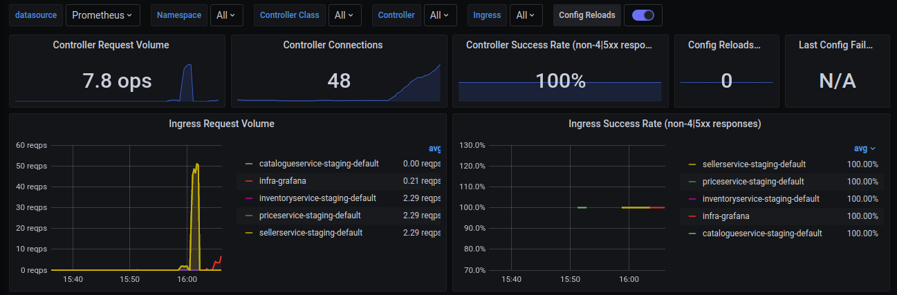
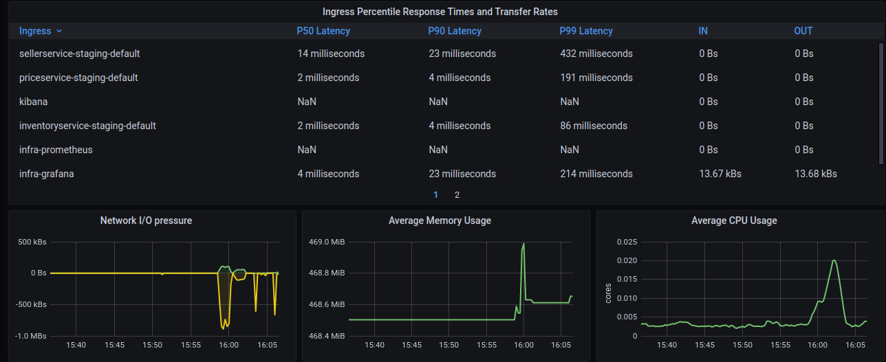

# Kubernetes Ingress Controller Dashboard

This Dashboard contains metrics visualization of Nginx Ingress Controller Running in Kubernetes Using Prometheus as Datasource. If you have prometheus and grafana installed on your cluster then prometheus will already be scraping this data due to the scrape annotation on the deployment.

# Dashboards

## Purpose of Each Panel using in Dashboard

Here you will see these information in dashboard

- Controller Request Volume
- Controller Connections
- Contoller Success Rate(non-4|5xx responses)
- Config Reloads
- Last Config Failed
- Ingress Request Volume
- Ingress Success Rate (non-4|5xx responses)
- Ingress Percentile Response Times and Transfer Rates
- Network I/O Pressure
- Average Memory Usage
- Average CPU Usage