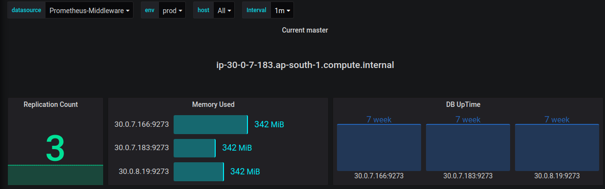
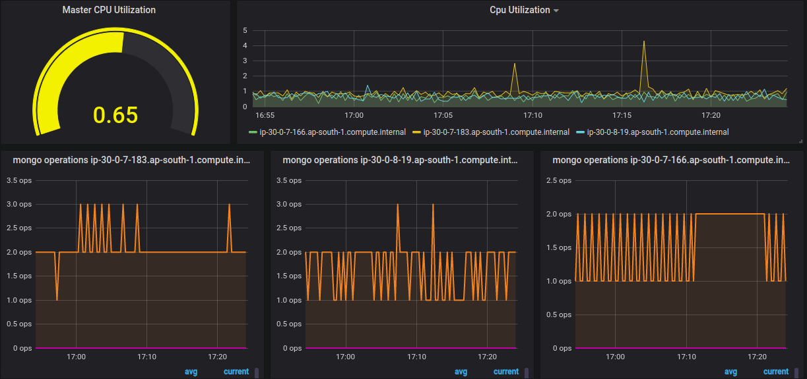
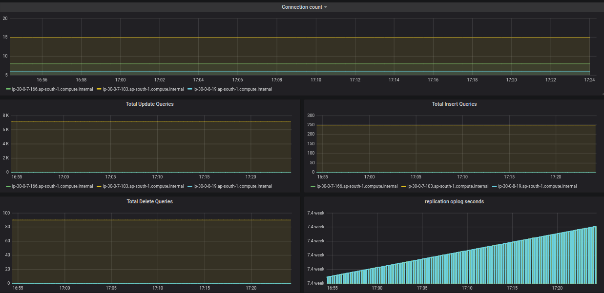

# Mongodb Dashboard

Mongodb Dashboard Visualization uses ```diff -telegraf``` as an exporter

#### These Dashboards needs ```mongodb``` as Telegraf Input Plugins


# Dashboards

## Node Level


## CPU Usage


## operations


# Purpose of Each Panel using in Dashboard
