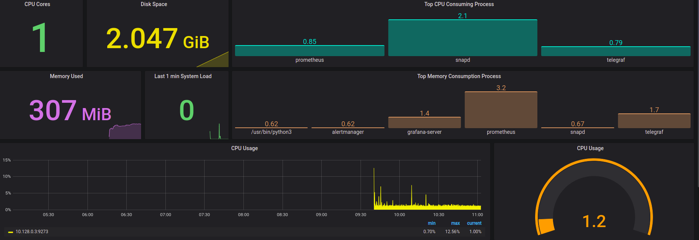
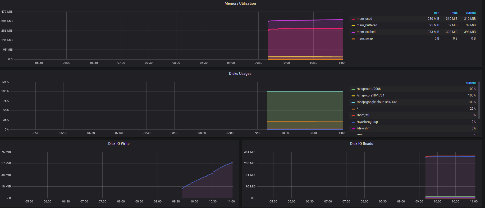

# Node Dashboard
This Dashboards contains node realted metrics visualization.

# Telegraf Input Plugins
Following the inpute plugins which should be enabled in telegraf to get each metrics in node dashbord panel.
- cpu
- disk
- io
- mem
- net
- system
- swap
- netstat
- processes
- kernel
- diskio
- procstat

# Dashboard Sample

# Dashboard Panels
- CPU Cores
- Disk Space
- Memory Load
- Last 1 min System Load
- Top CPU Consuming Process
- Top Memory Cunsuming Prcess
- CPU Usage
- CPU Usage
- Memory Utilization
- Disk Usages
- Disk IO Write
- Disk IO READ