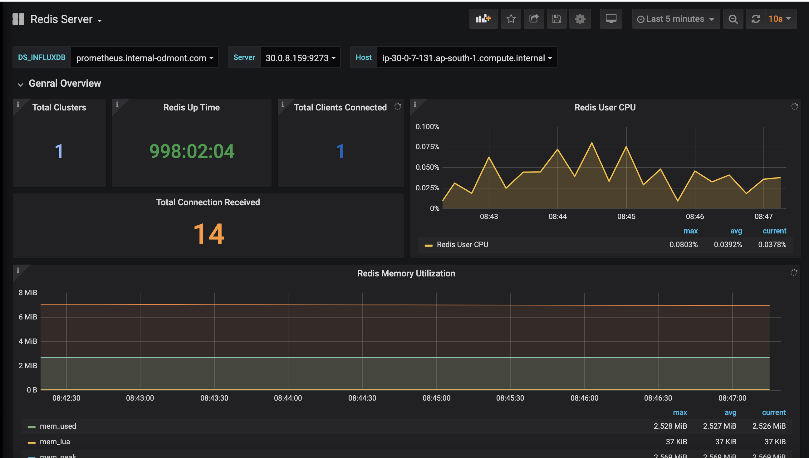
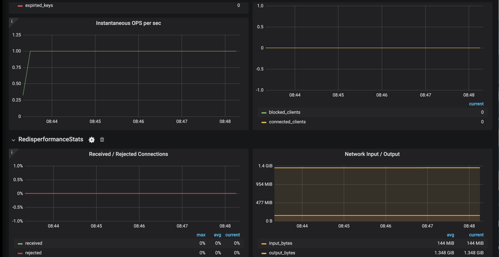

# Redis Dashboard

This Dashboard Monitor Redis using Promtheus as Data Source and telegraf as agent using redis input plugin.

# Inpute plugin Configuration
```
[[inputs.redis]]
  servers = ["tcp://redis:6379"]
##  e.g.
  ##    tcp://localhost:6379
  ##    tcp://:password@192.168.99.100
```
For more information on configuration and metrics detail of redis input plugin please [click here](https://github.com/influxdata/telegraf/tree/master/plugins/inputs/redis)

# Dashboard




# dashboard Panels
- Total Clusters
- Redis Up Time
- Total Clients Connected
- Total Connection Received
- Redis User CPU Usage
- Redis Memory Utilization
- Hit/Miss Rate
- Total Tracking Items
- Evicted/Expired Keys
- Total Keyspaces
- Total Commands Processed
- Total Connected Processed
- Instantaneous OPS Per Sec
- Received/Rejected Connections
- Network Input/Output