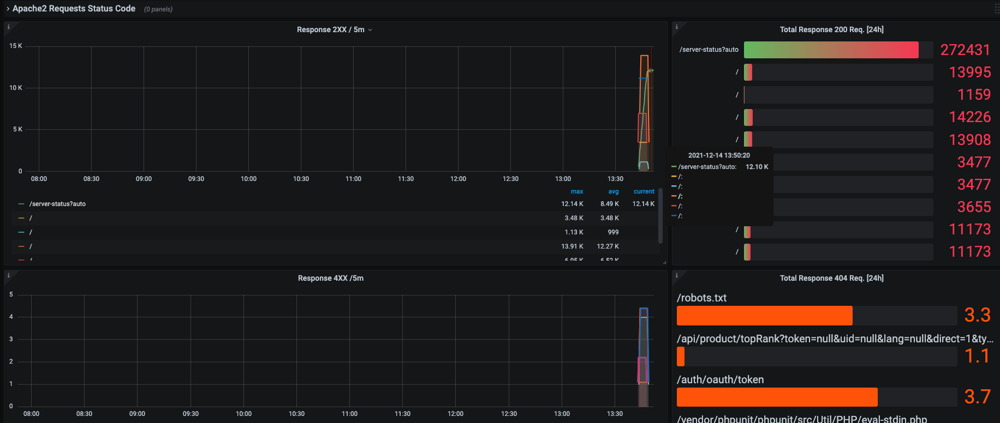
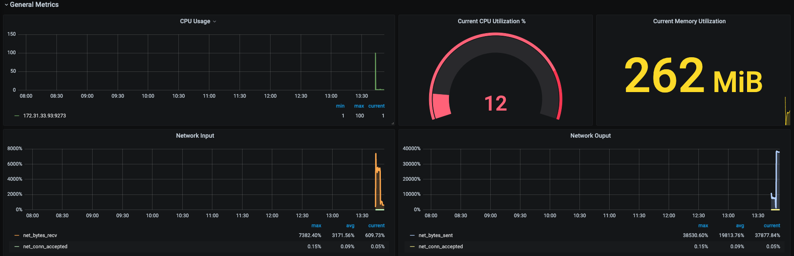
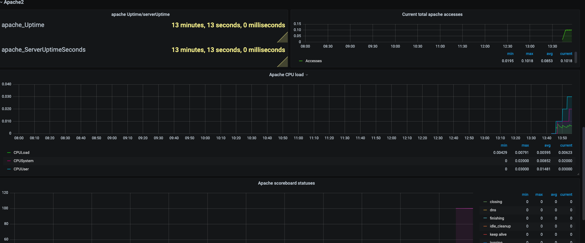
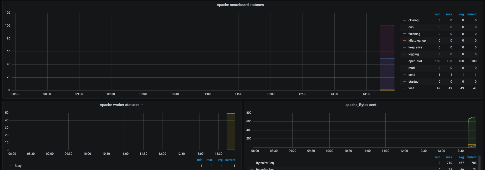

## Note
Please enable the Apache Server Status, following is the configuration we are using to enable Apache Server Status
```
ExtendedStatus on
<Location /server-status>
    SetHandler server-status
    Order deny,allow
    Deny from all
    Allow from 127.0.0.1
</Location>
```

## Telegraf Plugin Configuration
```
[inputs.cpu]]
    percpu = true
[[inputs.disk]]
[[inputs.io]]
[[inputs.mem]]
[[inputs.net]]
[[inputs.system]]
[[inputs.swap]]
[[inputs.netstat]]
[[inputs.processes]]
[[inputs.kernel]]
[[inputs.diskio]]
[[inputs.procstat]]
    user = "root,telegraf"
#Apache2 Metrics
[[inputs.apache]]
  urls = ["http://localhost:80/server-status?auto"]
  response_timeout = "5s"
[[inputs.tail]]
  name_override = "apache2log"
  files = ["/var/log/apache2/access.log"]
  from_beginning = true
  pipe = false
  data_format = "grok"
```

## Dashboard Images






## Contributor Information
**kirti.nehra@opstree.com**