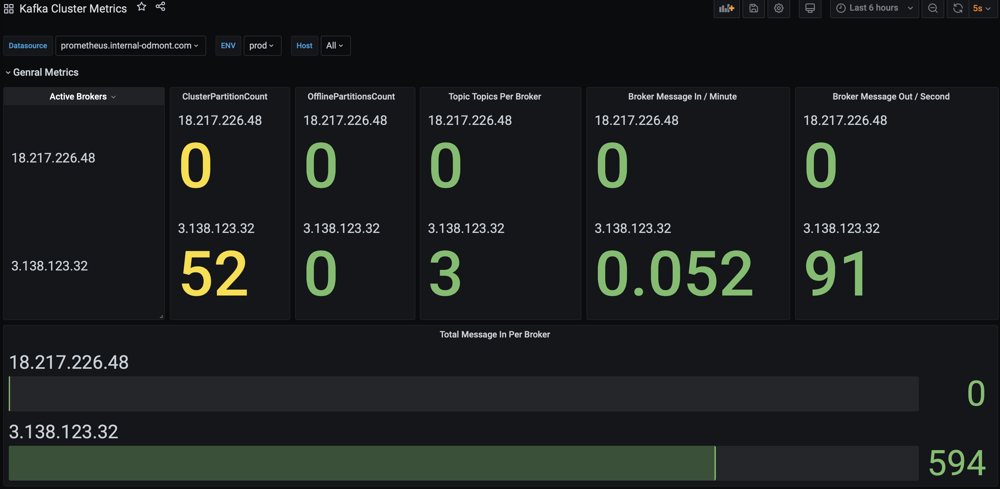
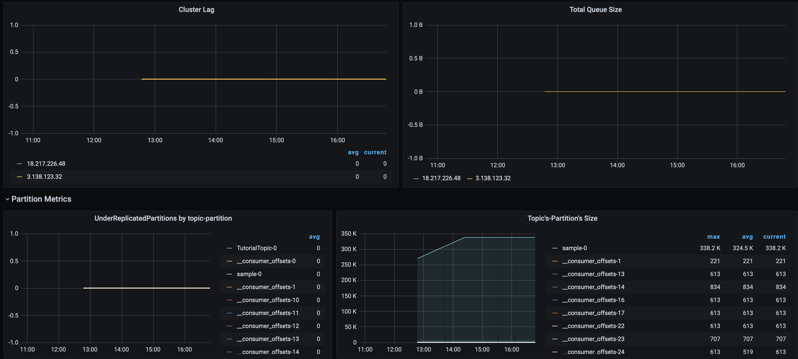
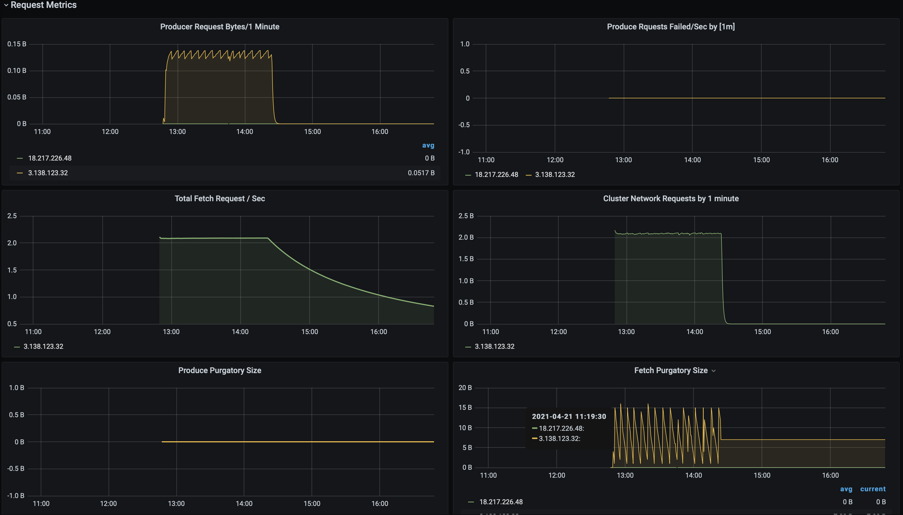
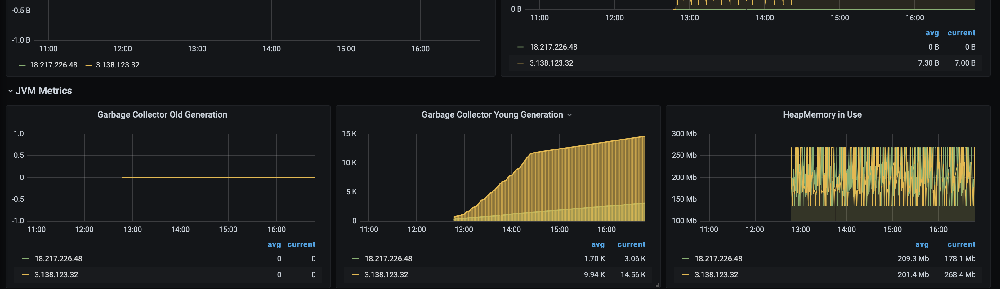
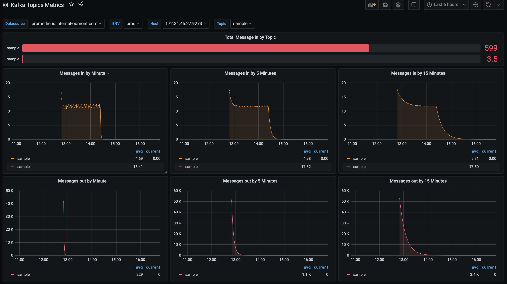
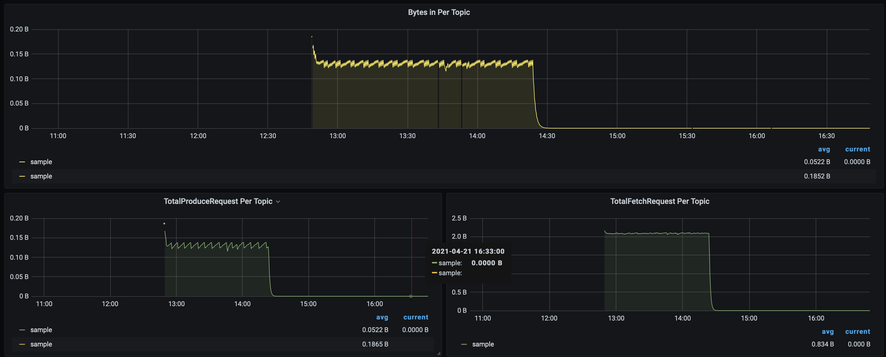

# Kafka Dashboard

# Telegraf Input Plugins
Following are the basic telegraf Configuration can be use.
```
[global_tags]

## Contributor Information
**mahesh.kumar@opstree.com**


# Configuration for telegraf agent
[agent]
    interval = "10s"
    debug = false
    hostname = "theone.us-central1-a.c.theone-277307.internal"
    round_interval = true
    flush_interval = "10s"
    flush_jitter = "0s"
    collection_jitter = "0s"
    metric_batch_size = 1000
    metric_buffer_limit = 10000
    quiet = false
    logfile = "/var/log/telegraf/telegraf.log"
    omit_hostname = false


###############################################################################
#                                  OUTPUTS                                    #
###############################################################################

[[outputs.prometheus_client]]
    listen = ":9273"

###############################################################################
#                                  INPUTS                                     #
###############################################################################

[[inputs.cpu]]
    percpu = true
[[inputs.disk]]
[[inputs.io]]
[[inputs.mem]]
[[inputs.net]]
[[inputs.system]]
[[inputs.swap]]
[[inputs.netstat]]
[[inputs.processes]]
[[inputs.kernel]]
[[inputs.diskio]]
[[inputs.procstat]]
    user = "root,telegraf,ubuntu"

```
# Jolokia Agent Config
```
## Read JMX metrics through Jolokia
 [[inputs.jolokia2_agent]]
   ## An array of Kafka servers URI to gather stats.
    urls = ["http://localhost:8778/jolokia"]
    name_prefix = "kafka."

    [[inputs.jolokia2_agent.metric]]
        name         = "controller"
        mbean        = "kafka.controller:name=*,type=*"
        field_prefix = "$1."

    [[inputs.jolokia2_agent.metric]]
        name         = "controller"
        mbean        = "kafka.consumer:type=consumer-fetch-manager-metrics,client-id=([-.w]+)"
        field_prefix = "$1."
        tag_keys     = ["topic", "consumer"]

    [[inputs.jolokia2_agent.metric]]
        name         = "replica_manager"
        mbean        = "kafka.server:name=*,type=ReplicaManager"
        field_prefix = "$1."

    [[inputs.jolokia2_agent.metric]]
        name         = "server_replicafetchmanager.maxlag"
        mbean        = "kafka.server:type=ReplicaFetcherManager,name=MaxLag,clientId=Replica"
        field_prefix = "$1."
        tag_keys     = ["topic", "ReplicaFetcherManager"]
    
    [[inputs.jolokia2_agent.metric]]
        name = "server_requesthandler_avgidlepct"
        mbean  = "kafka.server:name=RequestHandlerAvgIdlePercent,type=KafkaRequestHandlerPool"
        field_name = "$1"
        tag_keys   = ["topic"]

    [[inputs.jolokia2_agent.metric]]
        name         = "purgatory"
        mbean        = "kafka.server:delayedOperation=*,name=*,type=DelayedOperationPurgatory"
        field_prefix = "$1."
        field_name   = "$2"

    [[inputs.jolokia2_agent.metric]]
        name         = "client"
        mbean        = "kafka.server:client-id=*,type=*"
        tag_keys     = ["client-id", "type"]
    
    [[inputs.jolokia2_agent.metric]]
        name         = "server_replicafetchmanager.maxlag"
        mbean        = "kafka.server:type=ReplicaFetcherManager,name=MaxLag,clientId=Replica"
        tag_keys     = ["request", "network"]

    [[inputs.jolokia2_agent.metric]]
        name         = "request"
        mbean        = "kafka.network:name=*,request=*,type=RequestMetrics"
        field_prefix = "$1."
        tag_keys     = ["request", "network"]

    [[inputs.jolokia2_agent.metric]]
        name         = "network_processor_avgidlepct"
        mbean        = "kafka.network:name=NetworkProcessorAvgIdlePercent,type=SocketServer"
        field_prefix = "$1."
        tag_keys     = ["socketserver", "network"]

    [[inputs.jolokia2_agent.metric]]
        name         = "topics"
        mbean        = "kafka.server:name=*,type=BrokerTopicMetrics"
        field_prefix = "$1."

    [[inputs.jolokia2_agent.metric]]
        name         = "topic"
        mbean        = "kafka.server:name=*,topic=*,type=BrokerTopicMetrics"
        field_prefix = "$1."
        tag_keys     = ["topic"]

    [[inputs.jolokia2_agent.metric]]
        name       = "partition"
        mbean      = "kafka.log:name=*,partition=*,topic=*,type=Log"
        field_name = "$1"
        tag_keys   = ["topic", "partition"]

    [[inputs.jolokia2_agent.metric]]
        name       = "partition"
        mbean      = "kafka.cluster:name=UnderReplicated,partition=*,topic=*,type=Partition"
        field_name = "UnderReplicatedPartitions"
        tag_keys   = ["topic", "partition"]

    [[inputs.jolokia2_agent.metric]]
        name       = "controller_activecontrollers"
        mbean      = "kafka.controller:type=KafkaController,name=ActiveControllerCount"
        field_name = "$1"
        tag_keys   = ["controller"]
    
    [[inputs.jolokia2_agent.metric]]
        name       = "controller_offlinepartitions"
        mbean      = "kafka.controller:type=KafkaController,name=OfflinePartitionsCount"
        field_name = "$1"
        tag_keys   = ["controller"]
    
    [[inputs.jolokia2_agent.metric]]
        name       = "controller_stats_leaderelectionrateandtime"
        mbean      = "kafka.controller:type=ControllerStats,name=LeaderElectionRateAndTimeMs"
        field_name = "$1"
        tag_keys   = ["controller"]
    
    [[inputs.jolokia2_agent.metric]]
        name       = "controller_stats_uncleanleaderelections"
        mbean      = "kafka.controller:type=ControllerStats,name=UncleanLeaderElectionsPerSec"
        field_name = "$1"
        tag_keys   = ["controller"]

    [[inputs.jolokia2_agent.metric]]
        name       = "server_requesthandler_avgidlepct"
        mbean      = "kafka.server:name=RequestHandlerAvgIdlePercent,type=KafkaRequestHandlerPool"
        field_name = "$1"
        tag_keys   = ["topic", "requesthandler"]

    # Zookeeper Metrics
    [[inputs.jolokia2_agent.metric]]
        name       = "zookeeper_disconnects"
        mbean      = "kafka.server:type=SessionExpireListener,name=ZooKeeperDisconnectsPerSec"
        paths      = ["Count","OneMinuteRate","FiveMinuteRate","FifteenMinuteRate","MeanRate"]
        field_name = "$1"
        tag_keys   = ["zookeeper"]
   
    [[inputs.jolokia2_agent.metric]]
        name       = "zookeeper_sync_connects"
        mbean      = "kafka.server:type=SessionExpireListener,name=ZooKeeperSyncConnectsPerSec"
        paths      = ["Count","OneMinuteRate","FiveMinuteRate","FifteenMinuteRate","MeanRate"]
        field_name = "$1"
        tag_keys   = ["zookeeper"]

    [[inputs.jolokia2_agent.metric]]
        name       = "zookeeper_auth_failures"
        mbean      = "kafka.server:type=SessionExpireListener,name=ZooKeeperAuthFailuresPerSec"
        paths      = ["Count","OneMinuteRate","FiveMinuteRate","FifteenMinuteRate","MeanRate"]
        field_name = "$1"
        tag_keys   = ["zookeeper"]

    [[inputs.jolokia2_agent.metric]]
        name       = "zookeeper_readonly_connects"
        mbean      = "kafka.server:type=SessionExpireListener,name=ZooKeeperReadOnlyConnectsPerSec"
        paths      = ["Count","OneMinuteRate","FiveMinuteRate","FifteenMinuteRate","MeanRate"]
        field_name = "$1"
        tag_keys   = ["zookeeper"]

    [[inputs.jolokia2_agent.metric]]
        name       = "zookeeper_authentications"
        mbean      = "kafka.server:type=SessionExpireListener,name=ZooKeeperSaslAuthenticationsPerSec"
        paths      = ["Count","OneMinuteRate","FiveMinuteRate","FifteenMinuteRate","MeanRate"]
        field_name = "$1"
        tag_keys   = ["zookeeper"]

    [[inputs.jolokia2_agent.metric]]
        name       = "zookeeper_expires"
        mbean      = "kafka.server:type=SessionExpireListener,name=ZooKeeperExpiresPerSec"
        paths      = ["Count","OneMinuteRate","FiveMinuteRate","FifteenMinuteRate","MeanRate"]
        field_name = "$1"
        tag_keys   = ["zookeeper"]

    [[inputs.jolokia2_agent.metric]]
        name       = "heap_memory_usage"
        mbean      = "java.lang:type=Memory"
        paths      = ["HeapMemoryUsage"]
        field_name = "$1"
        tag_keys   = ["zookeeper"]

    [[inputs.jolokia2_agent.metric]]
        name       = "thread_count"
        mbean      = "java.lang:type=Threading"
        paths      = ["TotalStartedThreadCount","ThreadCount","DaemonThreadCount","PeakThreadCount"]
        field_name = "$1"
        tag_keys   = ["zookeeper"]

    [[inputs.jolokia2_agent.metric]]
        name       = "garbage_collector"
        mbean      = "java.lang:type=GarbageCollector,name=*"
        paths      = ["CollectionCount","CollectionTime"]
        field_name = "$1"
        tag_keys   = ["garbage_collector"]

```

## Dashbaord Images

### Kafka Cluster Dashboard






### Kafka Topic Dashboard



### Contributor Information
**mahesh.kumar@opstree.com**