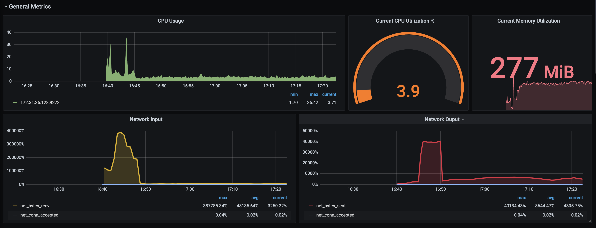
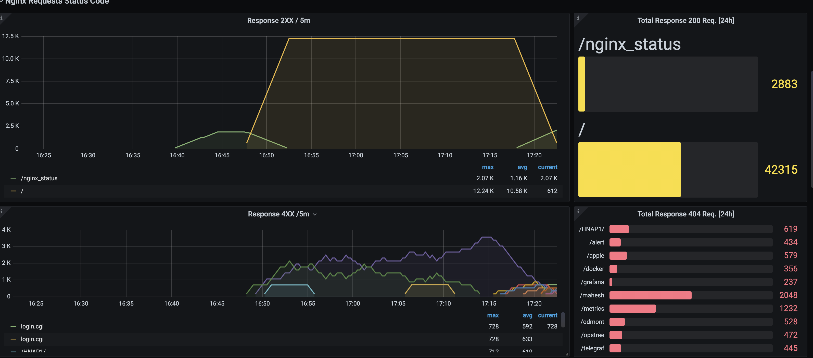
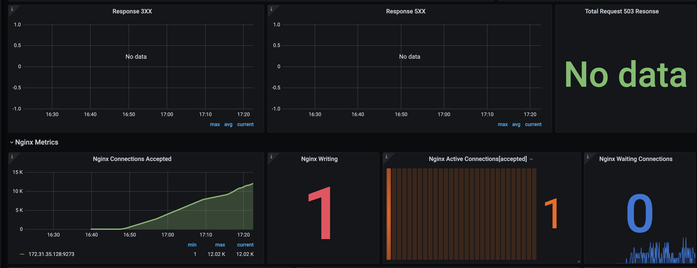
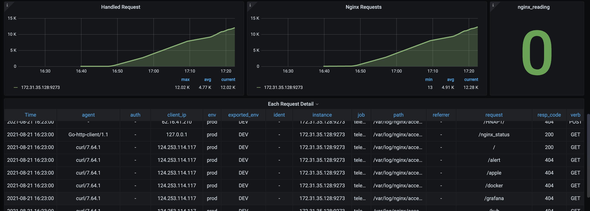

# Dashboard for Nginx Web Server.

## Dependencies
- Change the permission of the log file. Usually access log file can be found at `/var/log/nginx/access/log`. You can also find the path of the access log file in nginx.conf(Nginx Configuration file) file. Provide the path in the tail plugin of Telegraf.
- Enable the sub status module in Nginx, and add the following virtual host config in Nginx Web Server
```
server {
	listen 81 default_server;
	listen [::]:81 default_server;

	root /var/www/html;
	index index.html index.htm index.nginx-debian.html;

	server_name _;

	location / {
		try_files $uri $uri/ =404;
	}

	location /nginx_status {
        	stub_status;
        	allow 127.0.0.1;
        	deny all;
        }
}
```

## Telegraf Config
```
[[inputs.nginx]]
   urls = ["http://localhost/nginx_status"]
   response_timeout = "5s"
[[inputs.tail]]
  name_override = "nginxlog"
  files = ["/var/log/nginx/access.log"]
  from_beginning = true
  pipe = false
  data_format = "grok"
  grok_patterns = ["%{COMBINED_LOG_FORMAT}"]
[[inputs.cpu]]
  percpu = true
[[inputs.disk]]
[[inputs.diskio]]
[[inputs.io]]
[[inputs.net]]
[[inputs.mem]]
[[inputs.system]]
```

### Following the metrics monitor through the dashboard
- CPU Usage
- Current CPU Utilization %
- Current Memory Utilization
- Network Input
- Network Ouput
- Response 2XX / 5m
- Total Response 200 Req. [24h]
- Response 4XX  /5m
- Total Response 404 Req. [24h]
- Response 3XX
- Response 5XX
- Total Request 503 Resonse
- Nginx Connections Accepted
- Nginx Writing
- Nginx Active Connections[accepted]
- Nginx Waiting Connections
- Handled Request
- Nginx Requests
- nginx_reading
- Each Request Detail

## Dashboard Images






### Contributor Information
**kirti.nehra@opstree.com**