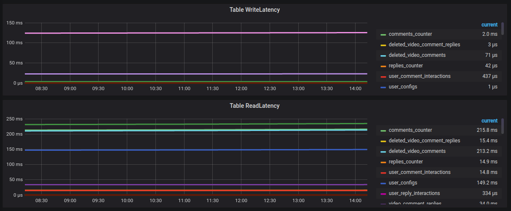

# Cassandra Dashboard

This Dashboard Monitor Cassandra using Promtheus as Data Source and telegraf as agent using jolokia input plugin.

# Conifguration
[[inputs.cassandra]]
    context = "/jolokia/read"
    servers = [":8778"]
    metrics = ["/java.lang:type=GarbageCollector,name=ConcurrentMarkSweep/CollectionTime",
                "/java.lang:type=GarbageCollector,name=ConcurrentMarkSweep/CollectionCount",
                "/java.lang:type=GarbageCollector,name=ParNew/CollectionTime",
                "/java.lang:type=GarbageCollector,name=ParNew/CollectionCount",
                "/java.lang:type=Memory/HeapMemoryUsage",
                "/java.lang:type=Memory/NonHeapMemoryUsage",
                "/org.apache.cassandra.metrics:type=Cache,scope=KeyCache,name=Hits",
                "/org.apache.cassandra.metrics:type=Cache,scope=KeyCache,name=Requests",
                "/org.apache.cassandra.metrics:type=Cache,scope=KeyCache,name=Entries",
                "/org.apache.cassandra.metrics:type=Cache,scope=KeyCache,name=Size",
                "/org.apache.cassandra.metrics:type=Cache,scope=KeyCache,name=Capacity",
                "/org.apache.cassandra.metrics:type=Cache,scope=RowCache,name=Hits",
                "/org.apache.cassandra.metrics:type=Cache,scope=RowCache,name=Requests",
                "/org.apache.cassandra.metrics:type=Cache,scope=RowCache,name=Entries",
                "/org.apache.cassandra.metrics:type=Cache,scope=RowCache,name=Size",
                "/org.apache.cassandra.metrics:type=Cache,scope=RowCache,name=Capacity",
                "/org.apache.cassandra.metrics:type=Client,name=connectedNativeClients",
                "/org.apache.cassandra.metrics:type=ClientRequest,scope=Read,name=TotalLatency",
                "/org.apache.cassandra.metrics:type=ClientRequest,scope=Write,name=TotalLatency",
                "/org.apache.cassandra.metrics:type=ClientRequest,scope=Read,name=Latency",
                "/org.apache.cassandra.metrics:type=ClientRequest,scope=Write,name=Latency",
                "/org.apache.cassandra.metrics:type=ClientRequest,scope=Read,name=Timeouts",
                "/org.apache.cassandra.metrics:type=ClientRequest,scope=Write,name=Timeouts",
                "/org.apache.cassandra.metrics:type=ClientRequest,scope=Read,name=Unavailables",
                "/org.apache.cassandra.metrics:type=ClientRequest,scope=Write,name=Unavailables",
                "/org.apache.cassandra.metrics:type=ClientRequest,scope=Read,name=Failures",
                "/org.apache.cassandra.metrics:type=ClientRequest,scope=Write,name=Failures",
                "/org.apache.cassandra.metrics:type=CommitLog,name=PendingTasks",
                "/org.apache.cassandra.metrics:type=CommitLog,name=TotalCommitLogSize",
                "/org.apache.cassandra.metrics:type=Compaction,name=CompletedTasks",
                "/org.apache.cassandra.metrics:type=Compaction,name=PendingTasks",
                "/org.apache.cassandra.metrics:type=Compaction,name=TotalCompactionsCompleted",
                "/org.apache.cassandra.metrics:type=Compaction,name=BytesCompacted",
                "/org.apache.cassandra.metrics:type=Storage,name=Load",
                "/org.apache.cassandra.metrics:type=Storage,name=Exceptions",
                "/org.apache.cassandra.metrics:type=Table,keyspace=*,scope=*,name=LiveDiskSpaceUsed",
                "/org.apache.cassandra.metrics:type=Table,keyspace=*,scope=*,name=TotalDiskSpaceUsed",
                "/org.apache.cassandra.metrics:type=Table,keyspace=*,scope=*,name=ReadLatency",
                "/org.apache.cassandra.metrics:type=Table,keyspace=*,scope=*,name=CoordinatorReadLatency",
                "/org.apache.cassandra.metrics:type=Table,keyspace=*,scope=*,name=WriteLatency",
                "/org.apache.cassandra.metrics:type=Table,keyspace=*,scope=*,name=ReadTotalLatency",
                "/org.apache.cassandra.metrics:type=Table,keyspace=*,scope=*,name=WriteTotalLatency",
                "/org.apache.cassandra.metrics:type=ThreadPools,path=internal,scope=CompactionExecutor,name=ActiveTasks",
                "/org.apache.cassandra.metrics:type=ThreadPools,path=internal,scope=AntiEntropyStage,name=ActiveTasks",
                "/org.apache.cassandra.metrics:type=ThreadPools,path=request,scope=CounterMutationStage,name=PendingTasks",
                "/org.apache.cassandra.metrics:type=ThreadPools,path=request,scope=CounterMutationStage,name=CurrentlyBlockedTasks",
                "/org.apache.cassandra.metrics:type=ThreadPools,path=request,scope=MutationStage,name=PendingTasks",
                "/org.apache.cassandra.metrics:type=ThreadPools,path=request,scope=MutationStage,name=CurrentlyBlockedTasks",\
                "/org.apache.cassandra.metrics:type=ThreadPools,path=request,scope=ReadRepairStage,name=PendingTasks",
                "/org.apache.cassandra.metrics:type=ThreadPools,path=request,scope=ReadRepairStage,name=CurrentlyBlockedTasks",
                "/org.apache.cassandra.metrics:type=ThreadPools,path=request,scope=ReadStage,name=PendingTasks",
                "/org.apache.cassandra.metrics:type=ThreadPools,path=request,scope=ReadStage,name=CurrentlyBlockedTasks",
                "/org.apache.cassandra.metrics:type=ThreadPools,path=request,scope=RequestResponseStage,name=PendingTasks",
                "/org.apache.cassandra.metrics:type=ThreadPools,path=request,scope=RequestResponseStage,name=CurrentlyBlockedTasks"
                ]

# Dashboard

# Cassandra Dashboard's Panels

**Genral Overview**
- Connected Native Clients

**Java Metrics**
- Java Heap Memory
- Java Non-Heap Memory
- Garbage Collection Count

**Cassandra Overview**
- Client Read Latency
- Client Write Latency
- Table ReadLatency
- LiveDiskSpaceUsed
- Disk IO Write
- Disk IO Read
- Cache Hits/s
- Thread Pool Active & Pending Tasks
- Commit Logs

